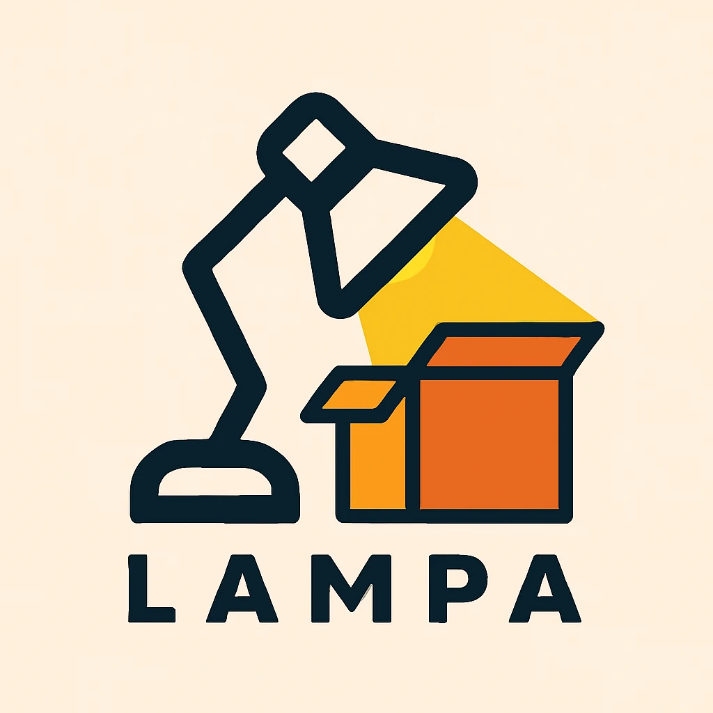

  

# Lampa

    <a href="https://mastodon.online/search?q=from%3A%40dector+%23lampa&type=statuses">Updates on Mastodon</a>

> [!WARNING]
> Pre-1.0 software: Lampa is currently in the early stages of development.
>
> :construction: :construction: :construction:
>
> Expect frequent breaking changes (especially in CLI arguments), bugs, suboptimal code, and limited functionality.
>
> But if you're feeling adventurous - feel free to try it, your feedback is highly appreciated!
> Please report any issues you encounter, and feel free to share your ideas in [Discussions](https://github.com/dector/lampa/discussions) tab — though I can't guarantee immediate prioritization.

## What is this

Lampa is a small tool that is useful for comparing two releases: it generates
overview reports where you can detect changes to third-party dependencies that are
added to the build.

## Getting Started

_Description TBD._

## How To Use

_Description TBD._

## Contributing

_Description TBD._

## License

Project is distributed under [MIT License](https://opensource.org/license/mit).
